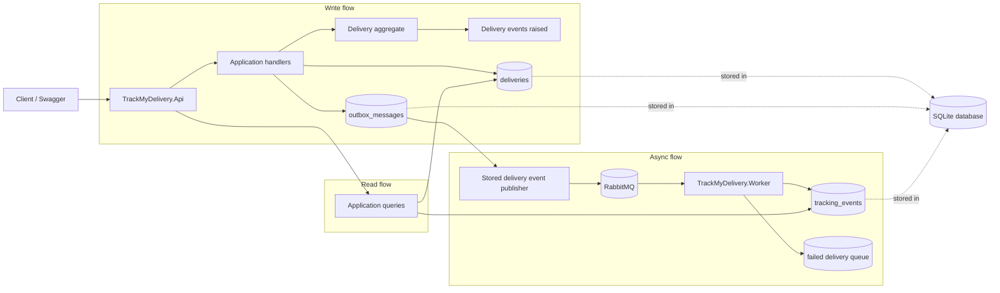
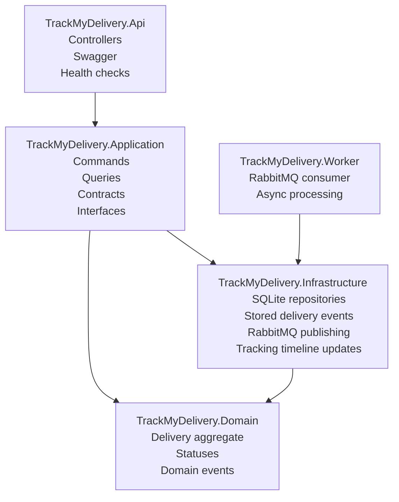

# TrackMyDelivery

TrackMyDelivery is a small delivery tracking platform built to showcase a clean backend structure with an event-driven workflow that is still easy to run locally.

The goal is to keep the repo practical:

- .Net 10 API for delivery commands and queries
- Domain model for delivery lifecycle rules
- SQLite for local persistence
- Outbox pattern for durable delivery event storage
- RabbitMQ for delivery event handoff between the API and worker
- Background worker that updates the tracking timeline from delivery messages

## Solution structure

- `TrackMyDelivery.Api`
  HTTP endpoints, Swagger, health checks, and application composition
- `TrackMyDelivery.Application`
  Commands, queries, contracts, and repository interfaces
- `TrackMyDelivery.Domain`
  Delivery aggregate, statuses, and domain events
- `TrackMyDelivery.Infrastructure`
  SQLite persistence, stored delivery events, RabbitMQ publishing, and tracking timeline updates
- `TrackMyDelivery.Worker`
  Background service that consumes delivery messages and updates the tracking timeline
- `TrackMyDelivery.Domain.Tests`
  Focused domain, persistence, and API integration tests

## Architecture diagram



## Layered view



## How it works

1. A client creates a delivery through the API.
2. The domain raises a delivery event.
3. The API persists the delivery and stores the delivery event in the outbox.
4. A background publisher reads stored delivery events and publishes them to RabbitMQ.
5. The worker consumes delivery messages from RabbitMQ.
6. The worker writes tracking events into the tracking timeline table.
7. Failed delivery messages are retried a limited number of times and then moved to a failed-delivery queue.
8. The API returns the tracking timeline from that projection.

This keeps the write flow durable, the boundary crossing explicit, and the read model separate enough to demonstrate the pattern without making the repo hard to follow.

RabbitMQ messaging is disabled by default in local settings, so the repo can still be explored without a broker running.

## Local run

Requirements:

- .NET 10 SDK
- RabbitMQ only if you want to run the broker-backed async flow locally

Run the API:

```powershell
dotnet run --project .\TrackMyDelivery.Api\TrackMyDelivery.Api.csproj --launch-profile https
```

Run the worker in another terminal:

```powershell
dotnet run --project .\TrackMyDelivery.Worker\TrackMyDelivery.Worker.csproj
```

Enable RabbitMQ publishing and consumption by setting `Messaging:Enabled` to `true` in:

- `TrackMyDelivery.Api\appsettings.json`
- `TrackMyDelivery.Worker\appsettings.json`

Useful URLs:

- Swagger: `https://localhost:7226/swagger`
- Health check: `https://localhost:7226/health`

SQLite database file:

- `TrackMyDelivery.SharedData\track-my-delivery.db`

## Example flow

1. `POST /api/deliveries`
2. `POST /api/deliveries/{deliveryId}/assign-courier`
3. `POST /api/deliveries/{deliveryId}/status`
4. `GET /api/deliveries/{deliveryId}/tracking`

The tracking endpoint only becomes interesting once the worker is running, because the worker is what turns stored delivery events into tracking timeline entries.

You can run the same flow from:

- `docs\demo-flow.http`

Set `@deliveryId` in that file after creating a delivery, then continue through the courier assignment, status update, and tracking timeline requests.

## Run tests

```powershell
dotnet test .\TrackMyDelivery.slnx
```

The test suite covers:

- delivery lifecycle rules in the domain model
- outbox persistence, publish state, and retry behavior
- delivery message attempt tracking
- API health check and delivery flow integration

## Logs

The API and worker write structured logs to the console and rolling files:

- API logs: `TrackMyDelivery.Api\logs\log-*.txt`
- Worker logs: `TrackMyDelivery.Worker\logs\worker-log-*.txt`

Useful things to look for:

- delivery IDs and tracking numbers during command handling
- stored delivery event publish counts
- worker messages showing delivery message consumption and tracking timeline updates
- retry and failed-delivery queue messages when delivery message handling fails

## Why SQLite

SQLite keeps the repo runnable with almost no setup:

- no cloud account
- no secrets
- no local database server
- one file on disk

That keeps the focus on architecture and flow instead of environment setup.

## Future improvements

- Add a replay path for failed delivery messages
- Add correlation IDs from API request to delivery message to tracking update
- Add deployment notes for Azure hosting
